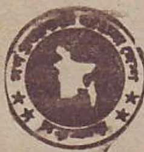

মৌলিক নং ১৯

বাংলাদেশ

গেজেট

অতিরিক্ত সংখ্যা

কর্তৃপক্ষ কর্তৃক প্রকাশিত

রবিবার, জানুয়ারী ২, ১৯৯৪

গণপ্রজাতন্ত্রী বাংলাদেশ সরকার

অর্থ মন্ত্রণালয়

অভ্যন্তরীণ সম্পদ বিভাগ

(আয়কর)

প্রজ্ঞাপন

তারিখ: ১৮ই পৌষ, ১৪০০/১লা জানুয়ারী, ১৯৯৪

এস, আর, ও নং ১-আইন/৯৪—যেহেতু গণপ্রজাতন্ত্রী বাংলাদেশ সরকার এবং ফেডারেল প্রজাতন্ত্রী জার্মানী সরকার মিত্র করারোপণ পরিহার এবং আয়ের উপর কর সম্পর্কিত রাজস্ব কার্যকর প্রতিরোধের জন্য ২৯শে মে, ১৯৯০ তারিখ একটি চুক্তি সম্পাদন করিয়াছে;

সেহেতু Income Tax Ordinance, 1984 (XXXVI of 1984) এর section 144 এ প্রদত্ত ক্ষমতাবলে সরকার নির্দেশ দিলেন যে, এতদুদ্দেশ্যে সংযোজিত উক্ত চুক্তির বিধানাবলী বাংলাদেশে কার্যকর হইবে।

চুক্তি

"Agreement  
between

the People's Republic of Bangladesh  
and  
the Federal Republic of Germany

for the Avoidance of Double Taxation with respect to Taxes on Income

The People's Republic of Bangladesh  
and  
the Federal Republic of Germany,

(৪৯)

মূল্য : টাকা ১.০০